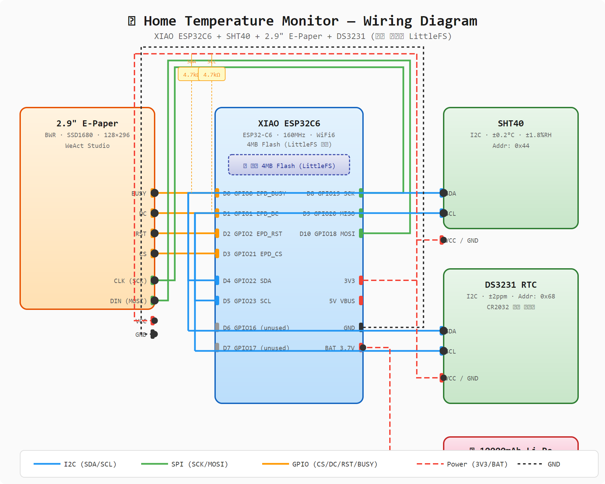

# 🏠 Home Temperature & Humidity Monitor

XIAO ESP32C6 / nanoESP32-C6 + SHT40 + 2.9" E-Paper + DS3231 (내장 플래시 LittleFS 저장)

---

## 📋 프로젝트 개요

| 항목 | 내용 |
|------|------|
| MCU | Seeed XIAO ESP32C6 (4MB) 또는 nanoESP32-C6 (**16MB**) (ESP32-C6, 160MHz, 512KB SRAM) |
| 온습도 센서 | Sensirion SHT40 (I2C, ±0.2°C, ±1.8% RH) |
| 디스플레이 | WeAct 2.9" Black-White-Red E-Paper (SPI, SSD1680, 128×296) |
| 데이터 저장 | **내장 플래시 LittleFS** (4MB: ~1.5MB / **16MB: ~12.8MB**) |
| RTC | DS3231 (I2C, ±2ppm, 내장 온도센서) |
| 배터리 | 10000mAh 리튬폴리머 |
| 통신 | WiFi 6 (NTP 시간동기화 + 웹서버 CSV 다운로드) |

### 지원 보드

| 보드 | .ino 파일 | 비고 |
|------|----------|------|
| **XIAO ESP32C6** | `HomeTempMonitor.ino` | 배터리 충전 회로 내장 |
| **nanoESP32-C6** | `HomeTempMonitor_nano.ino` | USB 2개, **16MB Flash**, 배터리 충전 회로 없음 |

---

## 🔌 배선도 (Wiring)



### XIAO ESP32C6 핀 할당

```
XIAO ESP32C6          부품
─────────────          ────
D0  (GPIO0)  ────────  EPD BUSY
D1  (GPIO1)  ────────  EPD DC
D2  (GPIO2)  ────────  EPD RST
D3  (GPIO21) ────────  EPD CS
D4  (GPIO22) ────────  I2C SDA  ──┬── SHT40 SDA
D5  (GPIO23) ────────  I2C SCL  ──┼── DS3231 SDA
                                   ├── SHT40 SCL
                                   └── DS3231 SCL
D6  (GPIO16) ────────  버튼 (WiFi 트리거)
D7  (GPIO17) ────────  (미사용)
D8  (GPIO19) ────────  SPI SCK  ──── EPD SCK (CLK)
D9  (GPIO20) ────────  SPI MISO (EPD 미사용, 예약)
D10 (GPIO18) ────────  SPI MOSI ──── EPD DIN (MOSI)
3V3            ────────  모든 모듈 VCC
GND            ────────  모든 모듈 GND
BAT            ────────  10000mAh Li-Po (+)
```

### nanoESP32-C6 핀 할당

```
nanoESP32-C6          부품
──────────────          ────
GPIO0         ────────  EPD BUSY
GPIO1         ────────  EPD DC
GPIO2         ────────  SPI SCK  ──── EPD SCK (CLK)
GPIO3         ────────  SPI MISO (EPD 미사용, 예약)
GPIO4         ────────  SPI MOSI ──── EPD DIN (MOSI)
GPIO5         ────────  EPD CS
GPIO6         ────────  I2C SDA  ──┬── SHT40 SDA
GPIO7         ────────  I2C SCL  ──┼── DS3231 SDA
                                   ├── SHT40 SCL
                                   └── DS3231 SCL
GPIO8         ────────  버튼 (WiFi 트리거) ⚠️ RGB LED와 공유
GPIO9         ────────  EPD RST
3V3           ────────  모든 모듈 VCC
GND           ────────  모든 모듈 GND
```

### 핀맵 비교표

| 기능 | XIAO ESP32C6 | nanoESP32-C6 |
|------|-------------|-------------|
| I2C SDA | GPIO22 (D4) | **GPIO6** |
| I2C SCL | GPIO23 (D5) | **GPIO7** |
| SPI SCK | GPIO19 (D8) | **GPIO2** |
| SPI MISO | GPIO20 (D9) | **GPIO3** |
| SPI MOSI | GPIO18 (D10) | **GPIO4** |
| EPD CS | GPIO21 (D3) | **GPIO5** |
| EPD DC | GPIO1 (D1) | GPIO1 (동일) |
| EPD RST | GPIO2 (D2) | **GPIO9** |
| EPD BUSY | GPIO0 (D0) | GPIO0 (동일) |
| 버튼 | GPIO16 (D6) | **GPIO8** ⚠️ |
| Deep Sleep 웨이크업 | `BIT(GPIO_NUM_16)` | `BIT(GPIO_NUM_8)` |

### I2C 풀업 저항
- SHT40과 DS3231이 같은 I2C 버스에 연결됨
- 두 모듈 모두 내부 풀업이 있으나, 안정성을 위해 **4.7kΩ 외부 풀업** 권장

### ⚠️ nanoESP32-C6 주의사항
- **GPIO8은 RGB LED(WS2812)와 공유** → 버튼 사용 시 LED를 반드시 끄고 핀을 INPUT으로 전환해야 함
- **배터리 충전 회로 없음** → Li-Po 사용 시 외부 TP4056 충전 모듈 필요
- **GPIO12/13은 CH343 USB-UART와 공유** → 디버그 직렬로 사용 중

---

## 📁 프로젝트 파일 구조

```
HomeTempMonitor/
├── HomeTempMonitor.ino        ← XIAO ESP32C6용 메인 스케치
├── HomeTempMonitor_nano.ino   ← nanoESP32-C6용 메인 스케치
├── partitions_16mb.csv        ← 16MB Flash 커스텀 파티션 테이블 (nano용)
├── DataLogger.h               ← LittleFS 데이터 로거 헤더
├── DataLogger.cpp             ← LittleFS 데이터 로거 구현
├── RTClib_DS3231.h            ← DS3231 RTC 드라이버 헤더
├── RTClib_DS3231.cpp          ← DS3231 RTC 드라이버 구현
├── WebServer.h                ← WiFi 웹서버 헤더
├── WebServer.cpp              ← WiFi 웹서버 구현
├── wiring_diagram.svg         ← 배선도 (SVG)
├── wiring_diagram.png         ← 배선도 (PNG)
├── case_laser_cut.svg         ← 아크릴 케이스 레이저 재단용
├── case_3d_preview.svg        ← 케이스 3D 조립 미리보기
├── epaper_preview.png         ← E-Paper 화면 미리보기
└── README.md                  ← 이 파일
```

> ⚠️ Arduino IDE에서는 폴더 내에 .ino 파일이 1개여야 합니다.
> nanoESP32-C6로 빌드할 때는 `HomeTempMonitor.ino`를 삭제하거나 이름을 바꾸고
> `HomeTempMonitor_nano.ino`를 `HomeTempMonitor.ino`로 이름 변경해서 사용하세요.

---

## 🛠️ Arduino IDE 설정

### 1. 보드 패키지 설치
- Arduino IDE → 파일 → 환경설정 → 추가 보드 매니저 URL:
  ```
  https://espressif.github.io/arduino-esp32/package_esp32_index.json
  ```
- 툴 → 보드 → 보드 매니저 → **esp32 by Espressif Systems** 설치 (v3.0.0+)

### 2. 보드 선택

| 보드 | Arduino IDE 보드명 |
|------|-------------------|
| XIAO ESP32C6 | **XIAO_ESP32C6** |
| nanoESP32-C6 | **ESP32C6 Dev Module** |

- Upload Speed: 921600

### 3. ⚠️ 파티션 스킴 설정 (중요!)

| 보드 | 파티션 스킴 | 방법 |
|------|------------|------|
| XIAO ESP32C6 (4MB) | **"Default 4MB with spiffs (1.2MB APP/1.5MB SPIFFS)"** | IDE에서 선택 |
| nanoESP32-C6 N16 (16MB) | **커스텀 파티션 테이블** | 아래 참조 |

이 설정이 없으면 LittleFS에 데이터를 저장할 공간이 없습니다!

#### nanoESP32-C6 (16MB) 커스텀 파티션 설정
1. `partitions_16mb.csv` 파일이 프로젝트 폴더에 포함되어 있습니다
2. Arduino IDE → 툴 → Partition Scheme → **"Custom"** 선택
3. 툴 → Partition Table → `partitions_16mb.csv` 파일 경로 지정
4. 또는 `boards.txt`에 다음 줄 추가:
   ```
   menu.PartitionScheme.custom=Custom Partition Table
   esp32c6.menu.PartitionScheme.custom.build.partitions=partitions_16mb.csv
   ```

**16MB 파티션 구성:**
```
┌──────────────┬───────────┬────────────┐
│ 영역          │ 크기       │ 용도       │
├──────────────┼───────────┼────────────┤
│ Bootloader   │ 36KB      │ 부트로더    │
│ App (ota_0)  │ 3.2MB     │ 애플리케이션│
│ LittleFS     │ 12.8MB    │ 데이터 저장 │
└──────────────┴───────────┴────────────┘
```

### 4. 라이브러리 설치
Arduino IDE → 스케치 → 라이브러리 포함하기 → 라이브러리 관리:

| 라이브러리 | 작성자 | 용도 | 필수 |
|-----------|--------|------|------|
| GxEPD2 | Jean-Marc Capello | E-Paper 디스플레이 드라이버 | ✅ 공통 |
| Adafruit SHT4x Library | Adafruit | SHT40 온습도 센서 | ✅ 공통 |
| Adafruit GFX Library | Adafruit | GxEPD2 의존성 (자동 설치됨) | ✅ 공통 |
| Adafruit NeoPixel | Adafruit | nanoESP32-C6 RGB LED 끄기 | ⚡ nano만 |

---

## ⚙️ 설정 변경

`.ino` 파일 상단의 CONFIGURATION 섹션에서 수정:

```cpp
#define SLEEP_INTERVAL_MIN       5       // 측정 간격 (분)
#define WIFI_SYNC_INTERVAL_HR    24      // WiFi/NTP 동기화 주기 (시간)
#define WIFI_AP_TIMEOUT_SEC      300     // 웹서버 활성 시간 (초)
#define WIFI_AP_SSID             "HomeTemp"  // AP 모드 이름
#define WIFI_SSID                "your_wifi_ssid"      // WiFi 이름
#define WIFI_PASSWORD            "your_wifi_password"   // WiFi 비밀번호
```

---

## 🔄 동작 흐름

```
[전원 ON / Deep Sleep 복귀]
         │
         ▼
  ┌──────────────┐
  │  I2C 초기화    │  SHT40 + DS3231
  │  센서 읽기     │  온도/습도 측정
  │  Min/Max 갱신  │  RTC 메모리 유지
  └──────┬───────┘
         │
         ▼
  ┌──────────────┐
  │  LittleFS     │  내장 플래시 마운트
  │  CSV 저장     │  /temp_log.csv 에 append
  └──────┬───────┘
         │
         ▼
  ┌──────────────┐
  │  E-Paper     │  온습도 + 시간 표시
  │  디스플레이    │  2.9" BWR 업데이트
  └──────┬───────┘
         │
         ▼
  ┌──────────────┐
  │  WiFi 필요?   │  24시간마다, 첫 부팅, 또는 버튼 누름
  │  ┌─ YES ──┐  │
  │  │ NTP 동기화│  RTC 시간 보정
  │  │ 웹서버   │  5분간 CSV 다운로드 가능
  │  │ AP 모드  │  공유기 없어도 직접 접속 가능
  │  └────────┘  │
  └──────┬───────┘
         │
         ▼
  ┌──────────────┐
  │  Deep Sleep   │  ~15μA 소비
  │  5분 대기     │  버튼 누르면 즉시 깨어남
  └──────────────┘
```

---

## 📥 CSV 다운로드 방법

### 방법 1: 🔘 버튼 누르기 (가장 쉬움)
1. D6(XIAO) 또는 GPIO8(nano)에 연결된 버튼을 누름
2. ESP32이 Deep Sleep에서 즉시 깨어남
3. WiFi 연결 시도 → 공유기 있으면 Station 모드, 없으면 AP 모드
4. E-Paper에 접속 방법 표시 (5분간)
5. 브라우저에서 CSV 다운로드

### 방법 2: 📡 공유기 연결 (Station 모드)
- E-Paper에 `http://192.168.x.x` 표시 → 브라우저 접속 → **Download CSV** 클릭

### 방법 3: 📶 AP 모드 직접 접속 (공유기 없어도 가능)
1. 스마트폰 WiFi에서 **"HomeTemp"** 네트워크 연결 (비번 없음)
2. 브라우저에서 **http://192.168.4.1** 접속
3. **Download CSV** 버튼 클릭

---

## 💾 데이터 저장 포맷 (내장 플래시 LittleFS)

### 저장 방식
- **CSV 파일** (`/temp_log.csv`) 로 내장 플래시 LittleFS 파티션에 저장
- 5분 간격 → 하루 288건 → 약 30KB/일
### 저장 용량 비교 (보드별)

| 보드 | 플래시 | LittleFS 가용 | 저장 기간 (5분 간격) |
|------|--------|-------------|-------------------|
| XIAO ESP32C6 | 4MB | ~1.5MB | ~50일 |
| nanoESP32-C6 N16 | **16MB** | **~12.8MB** | **~437일 (약 15개월)** |

- 5분 간격 → 하루 288건 → 약 30KB/일
- 파일이 1MB 초과 시 자동으로 오래된 절반 삭제 (rotate)

### CSV 포맷
```csv
timestamp,temperature_c,humidity_pct
2026-06-30 07:20:00,24.56,45.23
2026-06-30 07:25:00,24.61,45.18
2026-06-30 07:30:00,24.58,45.30
```

---

## 🔋 배터리 수명 추정

| 모드 | 전류 | 시간/사이클 |
|------|------|------------|
| Deep Sleep | ~15 μA | 4분 50초 |
| Active (측정+표시+저장) | ~80 mA | ~10초 |
| WiFi (24시간에 1회) | ~120 mA | ~300초 |

**5분 간격 기준:**
- 평균 전류: ~0.29 mA
- **10000mAh 기준 약 154일 (약 5개월)**

> ⚠️ nanoESP32-C6는 배터리 충전 회로가 없으므로, 외부 TP4056 충전 모듈이 필요합니다.

---

## 🖥️ E-Paper 디스플레이 레이아웃

```
┌──────────────────────┐
│  Home Climate        │
│══════════════════════│
│                      │
│  TEMPERATURE (빨강)  │
│                      │
│    24.5°C            │
│                      │
│  22.1~26.3°C (빨강) │
│                      │
│──────────────────────│
│                      │
│  HUMIDITY            │
│                      │
│    45.2%             │
│                      │
│  40.0~55.2%          │
│                      │
│══════════════════════│
│  06-30 07:23         │
│  SHT:OK  Log:OK      │
│  #42  5min  ~154d    │
└──────────────────────┘
   128 × 296 (세로)
```

---

## 🐛 디버그 모드

현재 코드는 **Deep Sleep이 비활성화**된 디버그 모드입니다.
- 보드가 꺼지지 않고 `loop()`에서 10초마다 재측정
- 시리얼 모니터(115200 baud)에서 실시간 로그 확인 가능

### 디버그 로그 예시
```
╔══════════════════════════════════════════╗
║  Home Temp Monitor  -  Boot #1
║  Board: nanoESP32-C6
║  Wakeup: POWER_ON/RESET
╚══════════════════════════════════════════╝
[RGB] LED turned OFF (GPIO8 shared with button)
[SETUP] Step 1: I2C + Sensors...
[I2C]  SDA=GPIO6, SCL=GPIO7
[RTC] 2026-07-21 14:55:00
[SHT40] Temp: 24.5 C | Hum: 45.2 %
[SETUP] Step 2: LittleFS...
[DataLogger] LittleFS mounted. Records: 0
[SETUP] Step 3: SPI + E-Paper...
[SPI]  SCK=GPIO2, MISO=GPIO3, MOSI=GPIO4
[EPD] 2.9" BWR initialized (portrait 128x296).
[SETUP] Step 5: Button GPIO8=released, wokeByButton=no
[SETUP] → Starting WiFi & Web server...
```

### Deep Sleep 활성화 (배포 시)
`.ino` 파일에서 주석 해제:
```cpp
esp_sleep_enable_ext1_wakeup(BIT(GPIO_NUM_8), ESP_EXT1_WAKEUP_ALL_LOW);  // nano
esp_sleep_enable_timer_wakeup(SLEEP_INTERVAL_MIN * 60ULL * 1000000ULL);
display.hibernate();
esp_deep_sleep_start();
```

---

## ⚠️ 주의사항

1. **파티션 스킴 필수**: 반드시 "Default 4MB with spiffs" 선택! 기본 설정은 LittleFS 공간이 없습니다.

2. **첫 업로드 후 LittleFS 포맷**: 처음 업로드 시 LittleFS가 자동 포맷됩니다. 이후 재업로드해도 데이터는 유지됩니다.

3. **RTC 백업 배터리**: DS3231에 CR2032 코인셀을 장착하면 전원 차단 시에도 시간이 유지됩니다.

4. **WiFi 자격증명**: `WIFI_SSID`와 `WIFI_PASSWORD`를 반드시 수정하세요.

5. **3색 E-Paper**: 빨간색 업데이트는 흑백보다 시간이 오래 걸립니다 (~15초). 정상 동작입니다.

6. **Deep Sleep**: ESP32C6의 Deep Sleep은 완전한 리셋으로 복귀합니다. `setup()`이 매번 실행되며, `RTC_DATA_ATTR` 변수만 유지됩니다.

7. **저장 용량**: XIAO(4MB)는 ~50일, nanoESP32-C6(16MB)는 ~437일 저장. 더 오래 보존하려면 주기적으로 CSV를 다운로드하세요.

8. **nanoESP32-C6 RGB LED**: GPIO8은 버튼과 WS2812 RGB LED가 공유합니다. 버튼 사용 시 LED를 반드시 끄고 핀을 INPUT으로 전환해야 합니다. (코드에 자동 반영됨)

9. **nanoESP32-C6 배터리**: 배터리 충전 회로가 없으므로 Li-Po 직접 연결이 불가합니다. 외부 TP4056 충전 보드가 필요합니다.

---

## 📦 부품 목록 (BOM)

### 공통 부품

| 부품 | 수량 | 비고 |
|------|------|------|
| WeAct 2.9" BWR E-Paper | 1 | SSD1680, 128×296 |
| Sensirion SHT40 | 1 | I2C 온습도 센서 |
| DS3231 RTC 모듈 | 1 | I2C, ±2ppm |
| CR2032 코인셀 | 1 | DS3231 백업 (옵션) |
| 10000mAh Li-Po 배터리 | 1 | 3.7V |
| 4.7kΩ 저항 | 2 | I2C 풀업 (옵션) |
| 택트 스위치 | 1 | WiFi 트리거 버튼 |
| 브레드보드/만능기판 | 1 | 연결용 |
| 점퍼 와이어 | 다수 | 연결용 |

### XIAO ESP32C6 구성

| 부품 | 수량 | 비고 |
|------|------|------|
| Seeed XIAO ESP32C6 | 1 | 배터리 충전 회로 내장 |

### nanoESP32-C6 구성

| 부품 | 수량 | 비고 |
|------|------|------|
| nanoESP32-C6 | 1 | USB 2개 (CH343 + 네이티브), **16MB Flash** |
| TP4056 충전 모듈 | 1 | Li-Po 충전용 (XIAO는 불필요) |

---

## 📝 변경 이력

| 날짜 | 내용 |
|------|------|
| 2026-07-21 | nanoESP32-C6 16MB Flash 커스텀 파티션 테이블 추가, 저장 용량 비교 정리 |
| 2026-07-21 | nanoESP32-C6용 .ino 추가, RGB LED OFF 코드 추가, README 업데이트 |
| 2026-07-21 | 버튼 핀 최우선 풀업 설정, 웨이크업 원인으로 WiFi 활성화 수정 |
| 2026-07-21 | DataLogger 시간 중복 +9h 버그 수정 |
| 2026-07-21 | Deep Sleep 디버그 모드 비활성화, loop() 10초 재측정 추가 |
| 2026-07-21 | 컴파일 에러 수정 (rotateLog 선언, ext1 wakeup, SHT40 begin) |
| 2026-07-21 | W25Q128 외장 플래시 → 내장 플래시 LittleFS로 변경 |
| 2026-07-21 | 프로젝트 초기 생성 |
